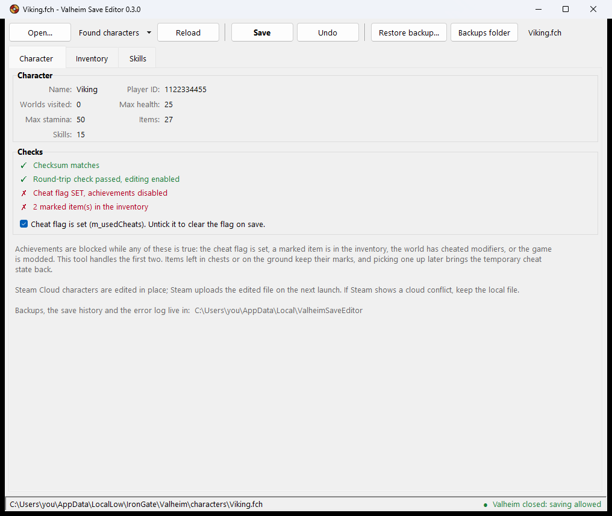
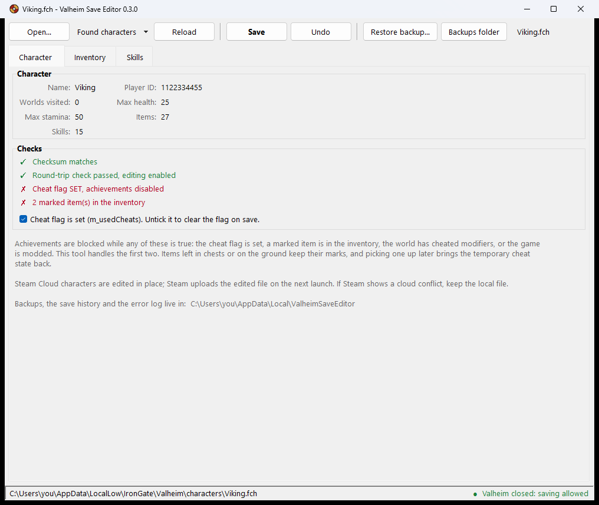
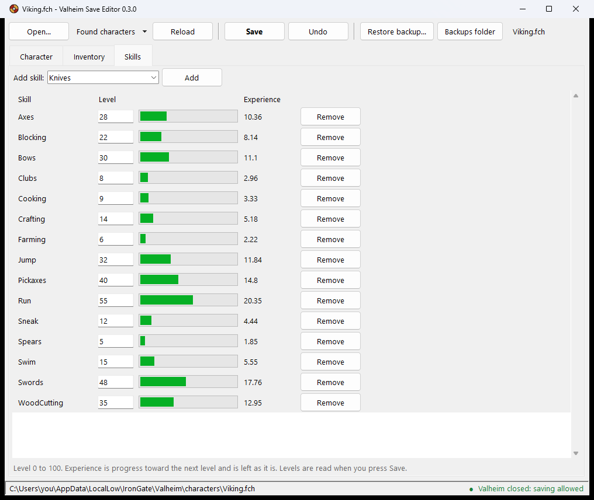

# Valheim Save Editor

Edit your own Valheim 1.0 character files (`.fch`) with the game closed. No mods, no
injection, nothing runs while the game does.

What it edits:

- **Cheat flag** (`m_usedCheats`), the per-character flag that disables achievements.
- **Cheated-item marks** on inventory items, one at a time or all at once.
- **Inventory**: add an item by its in-game or prefab name with stack, quality and
  durability, change those on an existing item, or remove one. Added items can carry your
  character's name as the crafter, the same as gear you crafted yourself, or no crafter at
  all, the same as raw materials.
- **Skills**: level of every skill, add or remove skills.

What it does not touch: worlds, other players, servers, anything while the game is running.
Steam version only; the Xbox/Game Pass build stores characters in a container this tool
cannot open.

## Download

- **Windows exe**: grab `ValheimSaveEditor.exe` from the
  [Releases](https://github.com/Domphill/Valheim-Save-Editor/releases) page. It is built
  by the CI workflow in this repository from the tagged source. Windows SmartScreen warns
  about any unsigned download; some antivirus products flag PyInstaller builds. If that
  bothers you, run from source instead.
- **From source** (Windows, Linux, Steam Deck desktop mode): needs Python 3.10+ with
  tkinter, which the python.org and Microsoft Store builds include. On Debian/Ubuntu
  install `python3-tk`. No other dependencies.

      python app.py [path\to\Character.fch]

## Safety

- Refuses to save while `valheim.exe` is running, and shows the game's state in the status
  bar. The game rewrites the character file on exit and would overwrite your edit.
- Backs up the original before every save to
  `%LOCALAPPDATA%\ValheimSaveEditor\backups` (Windows) or
  `~/.local/share/ValheimSaveEditor/backups` (Linux). *Restore backup…* puts one back.
- Shows exactly what will change before writing, and appends every save to `history.log`
  next to the backups.
- Writes to a temporary file, verifies the SHA-512 checksum and re-parses the result, then
  replaces the original in one step.
- A file is only editable if rebuilding it **with no changes** reproduces it byte for byte.
  If a future game update changes the format, the tool opens the file read-only instead of
  guessing.

## Where the files are

*Found characters* lists every `.fch` it can see:

- `%USERPROFILE%\AppData\LocalLow\IronGate\Valheim\characters` and `characters_local`
- Steam Cloud characters: `<Steam>\userdata\<id>\892970\remote\characters`
- Linux: `~/.config/unity3d/IronGate/Valheim/...` and the Steam `userdata` folder

Steam Cloud characters are edited in place. Steam uploads the changed file on the next
launch. If Steam shows a cloud conflict dialog, keep the **local** file.

## Usage

1. Close Valheim completely.
2. *Found characters* → pick your character, or *Open…* (the game's own previous save,
   the `.old` file, can be opened too).
3. Character tab: untick the cheat flag. Inventory tab: red tiles are marked; *Clear all
   marks*. Click an item to change its stack, quality or durability, then *Apply to
   selected*. Click an empty slot, type in the search box and pick from the list to add an
   item. In-game names work ("iron sword", "scrap iron", "core wood", "megingjord") in any
   word order, as do prefab names. Skills tab: type levels.
4. *Save*. A dialog lists exactly what will change before anything is written. Launch the
   game and check the item tooltips and the achievements screen.

Shortcuts: Ctrl+O open, Ctrl+S save, Ctrl+Z undo the last inventory or flag change, arrow
keys move around the grid, Delete removes the selected item. An asterisk in the title means
unsaved changes.

Unexpected errors go to `error.log` in the same folder as the backups; attach it when
reporting a problem.

## Command line

For machines without a desktop, or for scripting. Same backup and verification as the GUI.

    python -m vse dump  Character.fch
    python -m vse clear Character.fch            # cheat flag and item marks (--flag / --marks for one)
    python -m vse skill Character.fch Swords=55 Run=40
    python -m vse add   Character.fch ArrowIron --slot 7,1 --stack 100
    python -m vse add   Character.fch IronScrap --slot 6,1 --stack 30 --no-crafter

Slots are `column,row`, columns 0 to 7, rows 0 to 3, row 0 being the hotbar.

## Things to know

- Items in **chests or on the ground keep their marks**. Picking one up later puts the
  character back in the temporary cheat state until it leaves the inventory.
- **Crafting from marked materials produces a marked item.** Clear the finished item, not
  the materials.
- The game **re-marks any item whose total damage is over 10000** when it loads the
  character. Clearing those will not stick.
- A **world** that had cheats used in it stays flagged. A clean character entering a
  flagged world is not flagged by it.
- Durability is stored as a number the game shows divided by 100. The tool shows the
  game's number. For food, arrows and materials 100 is correct; for gear enter that
  item's real maximum or it will show as damaged.
- Stack limits are not enforced beyond a warning above 100. Keep arrows at 100 or below,
  most materials at 50 or 30 (ore and metal), food at 20.
- The **in-game names** used for searching and labelling come from a hand-written table
  covering the common items up to Mistlands. The prefab name is always what gets written.
  If a name is wrong or missing, open an issue or a pull request against `vse/search.py`.

Verified with Valheim 1.0 (character profile version 46, player data version 33). The
tool refuses any other version rather than guess.

## Build a single exe (optional)

    powershell -File build.ps1

Produces `dist\ValheimSaveEditor.exe` with PyInstaller, using the icon in `assets/`.

## Tests

    python -m unittest discover -s tests -v

Set `VSE_TEST_FCH=<path>` to also run the round-trip test against a real save. It only
reads the file. The GUI tests skip themselves where no display is available.

## Credits and license

Written by DAP. The `.fch` parsing logic and the item hash table are derived from
[ValterKane/ValhaimCheaterRemover](https://github.com/ValterKane/ValhaimCheaterRemover)
(MIT). Item flag bits for *picked up* and *equipped*, the crafter stamping, the
round-trip guard, the save pipeline, the search and the interface are new.

MIT License. See `LICENSE`.

Not affiliated with or endorsed by Iron Gate Studio or Coffee Stain Publishing. Valheim is
their trademark. This tool edits files on your own computer; use it at your own risk and
keep the backups it makes.
